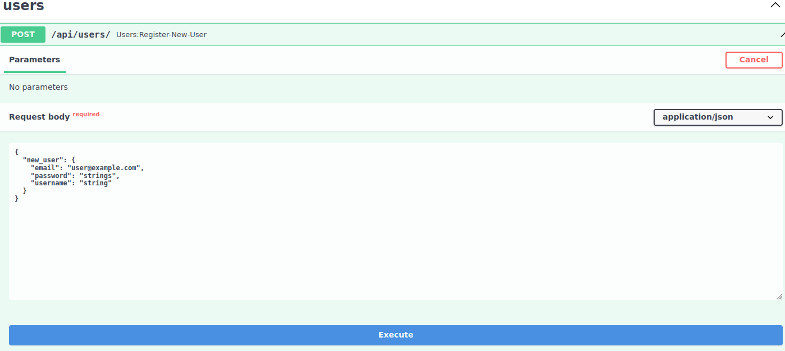
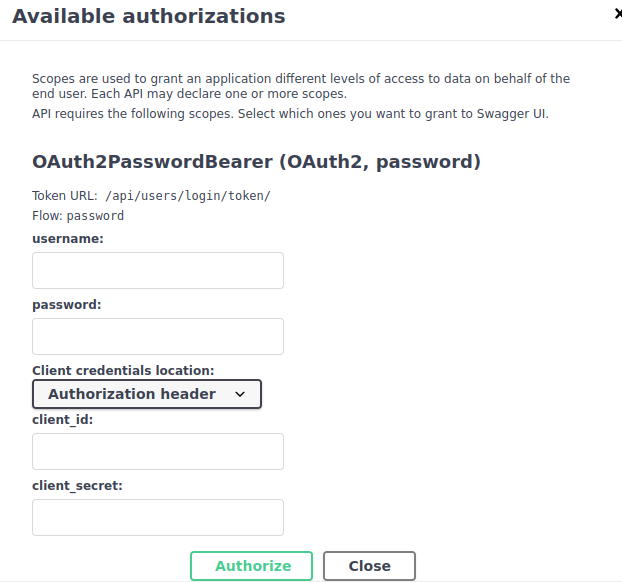
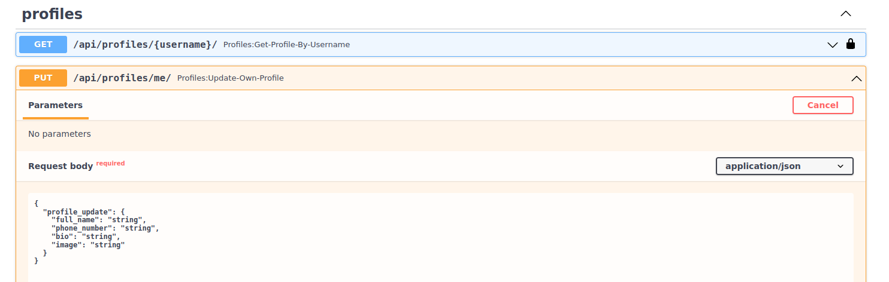
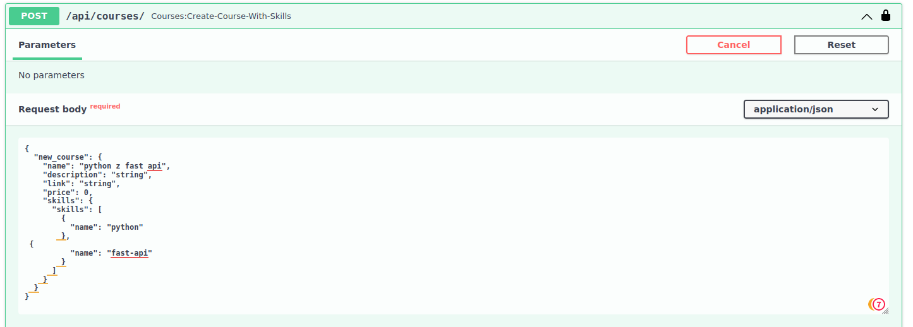
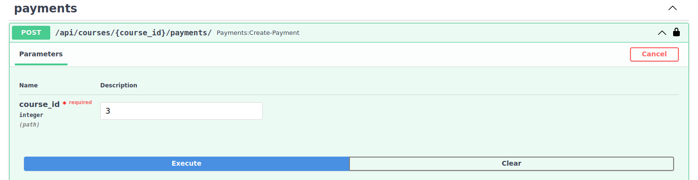
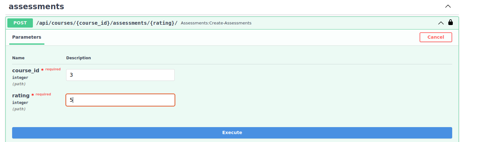
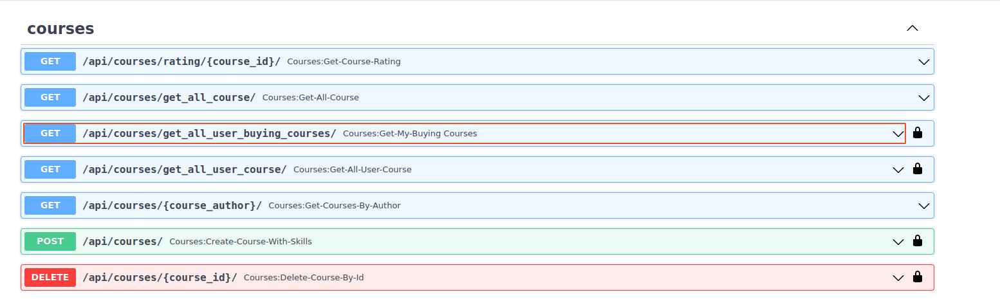
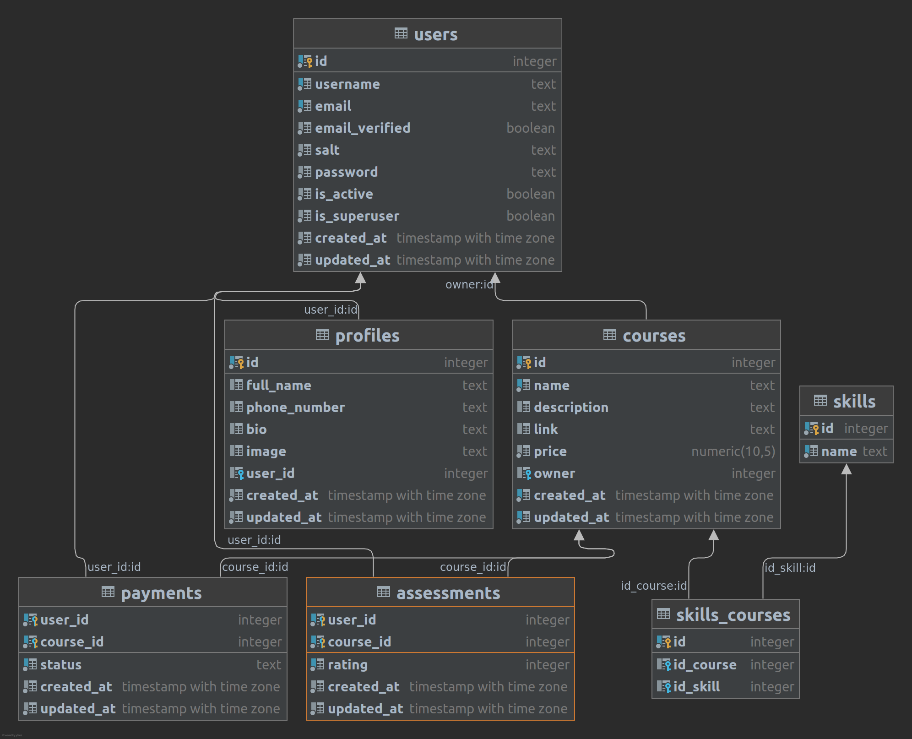

About
========
This is my first website application with database. The project currently only has a backend.

Technologies used
======

1. Docker
2. Python
3. Fast-Api
4. Postgresql

Functionality implemented
======

1 Create Users
=====

2 User login
======
The application can be used by several users at the same time

3 Updating User Profile
======

4 Course Creation
=======
• User must be logged in to add a course. • When adding a course, you can add a list of the skills it includes this
course. • The courses do not contain any files (eg PDF), only a link (eg to the course on Youtube).

5 Course Acquisition
======
• Anyone can purchase the courses for free. • The user must be logged in to purchase the course. • The course owner (
author) cannot purchase his course. • To purchase a course, you must enter the course id

6 Course Assessment
=======
• You must have acquired a course in order to be able to evaluate it. • To rate a course, you must enter the course id.
• The grade must be between 1 and 5.

7 Possibilities of filtering, removing courses.
========
• Display of all courses (no skills required, no need to be logged in important). • View all the courses you have
acquired (with the skills you have acquired)
they say). • Display of all created courses by the user. • View all created courses by the specified author. • Average
course grade (course id must be provided). • Possibility to delete your course being created (you must enter your course
id)

Database
=========
The database does not contain an author table, this is because the authoring user the course becomes the author.

How to run applications
=====

1. Download from the GitHub project.
2. Have docker with docker-compose installed.
3. Run the docker-compose up –build.

Sources
=====
• The application has been done on the basis of the tutorial:
https://www.jeffastor.com/blog/populating-cleaning-jobs-with-user-offers-in-fastapi
